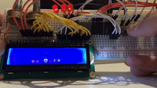

# AVR Minigame

Turning my Atmega32 and LCD display into a game console. 

## Hardware

- ATMEGA32A Microprocessor
- LCD1602 (HD44780 Controller)

## Youtube preview (click)
[

](https://www.youtube.com/watch?v=WK2qw3AxCYA) 
